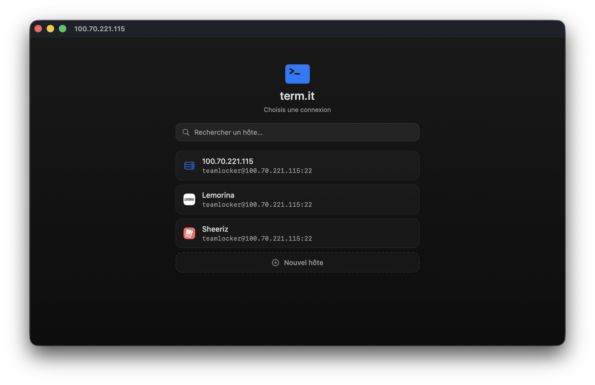
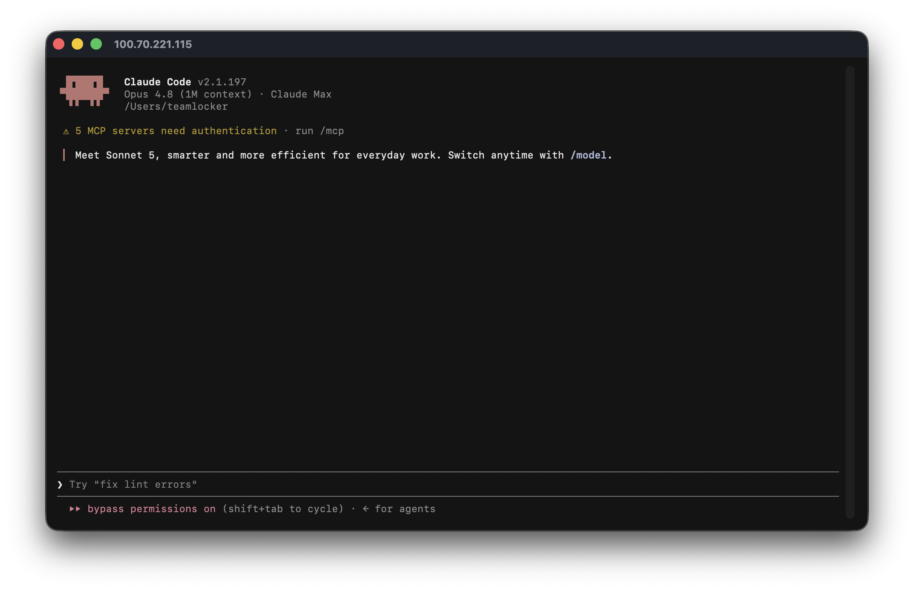
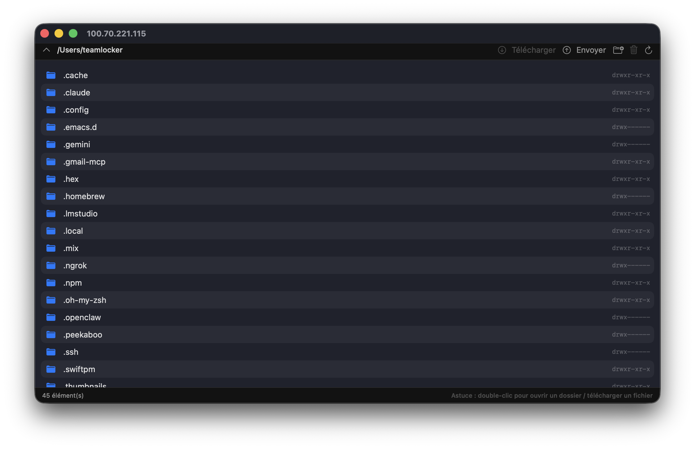
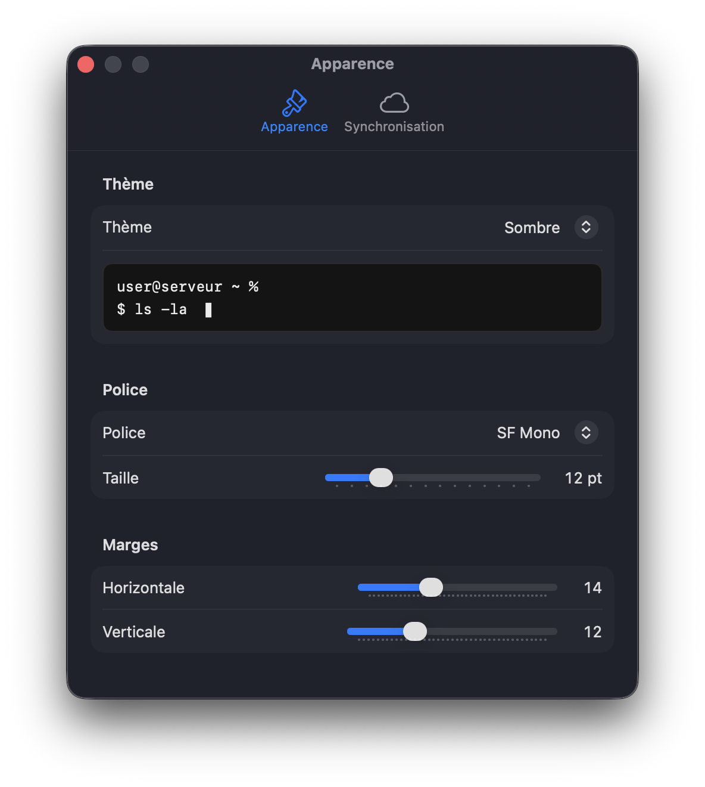

# term.it

A free, open-source, **native macOS SSH & SFTP client** built with Swift and SwiftUI — a lightweight alternative to Termius. No Electron, no account, no subscription.

> 🇫🇷 Client SSH/SFTP natif macOS, gratuit et open-source. Alternative légère à Termius.


## 📸 Screenshots

|  |  |
|:--:|:--:|
|  |  |
| **Connection picker** | **Full-screen terminal** |
|  |  |
| **SFTP file browser** | **Themes & settings** |

## ✨ Features

- 🖥️ **Full SSH terminal** — xterm-256color emulation (SwiftTerm), scrollback, mouse reporting (works with TUIs like `claude`, `vim`, `htop`)
- 📁 **SFTP file browser** — Finder-style selection, upload/download, delete, new folder, drag & drop both ways
- 🪄 **Drag a file onto the terminal** → it uploads to `/tmp` on the server and pastes the remote path
- 🔐 **Auth** by password or OpenSSH private key (ed25519 / RSA), secrets stored in the macOS Keychain
- 🛡️ **Known-hosts verification** (TOFU) — warns if a server's key changes
- 🔀 **Local port forwarding** (SSH tunnels, `-L`) managed per host
- 🎨 **Themes & appearance** — built-in themes, font & size, adjustable padding, live preview
- 🪟 **Immersive UI** — full-screen terminal, hover-reveal top bar (Terminal/Files) and left dock (active sessions)
- 🔗 **Multi-session** + **detach** a connection into its own window
- ⚡ **Custom icons** per host (SF Symbols or your own image) + per-host startup command (snippet)
- ☁️ **iCloud sync** — connections via iCloud Drive, passwords via iCloud Keychain (no server)

## 📦 Requirements

- macOS 15 (Sequoia) or later
- Xcode 16+ (for building)

## 🛠️ Build & run

```bash
git clone https://github.com/telenc/term.it.git
cd term.it

# Build a signed .app bundle (ad-hoc signature by default)
./package.sh release
open build/term.it.app

# Or, for quick development
swift run
```

> The build script signs with your **Developer ID** if one is found (keeps the Keychain
> "Always Allow" across rebuilds), otherwise falls back to an ad-hoc signature.

## 🧱 Architecture

```
Sources/termit/
├── App/        SwiftUI entry point + SwiftData container + Settings scene
├── Models/     Host, HostGroup (SwiftData)
├── Stores/     Keychain, credential resolver, iCloud sync, settings/themes
├── SSH/        SSHConnection (Citadel): shell PTY, SFTP, command exec
└── Views/      RootView (shell), Launcher, Terminal, SFTP browser, Host form, Settings
```

Built on:
- [SwiftTerm](https://github.com/migueldeicaza/SwiftTerm) — terminal emulator
- [Citadel](https://github.com/orlandos-nl/Citadel) — SSH/SFTP over SwiftNIO

## 🗺️ Roadmap

- [x] Known-hosts verification (TOFU)
- [x] Port forwarding (local SSH tunnels)
- [x] Upload progress for large transfers
- [ ] App notarization for easy distribution
- [ ] iCloud Keychain sync for passwords (needs entitlements / Xcode project)

## 🤝 Contributing

Contributions are welcome! See [CONTRIBUTING.md](CONTRIBUTING.md).

## 📄 License

MIT — see [LICENSE](LICENSE).

## ⚠️ Security note

Server host keys are verified on a trust-on-first-use basis: the key is stored on
the first connection and you're warned (and the connection blocked) if it changes
later. Passwords/keys are stored in the macOS Keychain and never written to disk in
plain text.
